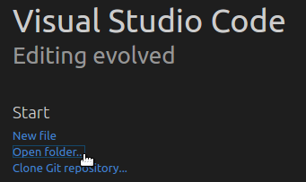
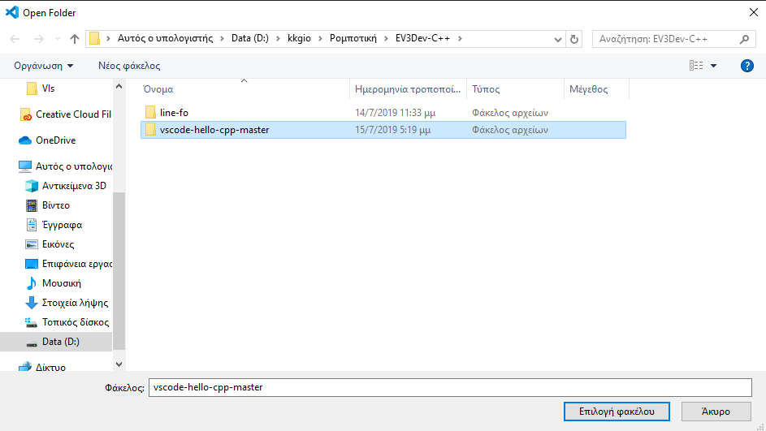
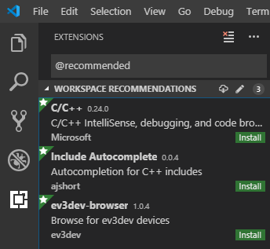

# vscode-hello-cpp
Hello World for [ev3dev] + [Visual Studio Code][code] + [C++]

## Overview
This is a git repository to help you get started programming a robot using
ev3dev in Visual Studio Code using the C++ programming language on Windows.

## Prerequisites
* LEGO MINDSTORMS EV3 with [ev3dev] installed. **Does not work with ev3dev-jessie!
  Be sure to grab a snapshot image of ev3dev-stretch.**
* A computer (Windows) with [Visual Studio Code][code]

## Cross-compiling Windows 10
Windows 10 supports the Windows Subsystem for Linux which allows us to install and execute the entire compiler toolchain. The steps required to compile native-mode EV3 applications on Windows 10 is as follows:

1. Be sure that your Windows 10 installation has Windows Subsystem for Linux installed. First make sure Developer Mode is enabled under Settings --> Update & Security --> For developers. Then, go to Control Panel --> Programs and Features --> Turn Windows Feature On/Off and check the box next to Windows Subsystem for Linux (Beta).

2. Install Ubuntu 16.04 LTS from the Microsoft Store

3. Fire up the bash shell by pressing Start Key, type `bash` and press `Enter`. This will open up Bash on Ubuntu on Windows.

4. Type the following commands:
```sh
sudo apt update
sudo apt upgrade
sudo apt install gcc-arm-linux-gnueabi g++-arm-linux-gnueabi
sudo apt install build-essential
```

## Step-by-Step
1. Download the [vscode-hello-cpp][zip] project from GitHub and unzip it.

   [zip]: https://github.com/kkgiorgos/vscode-hello-cpp/archive/master.zip
   
2. Open the `vscode-hello-cpp-master` folder in Visual Studio Code.

  
  
  
  
3. Click *Show Recommendations* when asked.

  
  
4.  Install the `ev3dev-browser` extension. The Go extension is optional, but it
    is nice to have too.

    


[ev3dev]: http://www.ev3dev.org
[code]: https://code.visualstudio.com/
[C++]: https://isocpp.org/
[git]: https://git-scm.com/
[github]: https://desktop.github.com/
